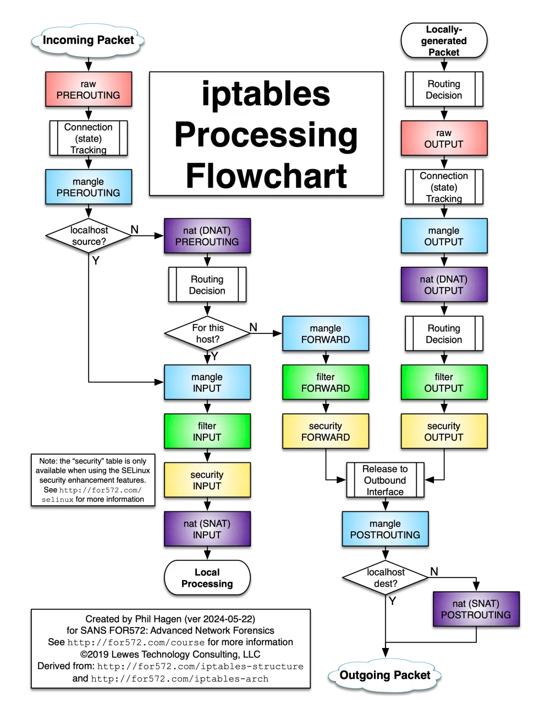

import Tabs from '@theme/Tabs';
import TabItem from '@theme/TabItem';

# iptables
Linux 内核中的 netfilter 框架提供了各种网络流量处理功能，如数据包过滤、网络地址转换等，而 iptables 则是用于配置和管理相关功能的用户空间工具。iptables 整体由五张表（tables）组成，每张表包含多条链（chains），每条链又由一系列有序规则（rules）构成：

<div className='center-table'>
|            | PREROUTING | INPUT | FORWARD | OUTPUT | POSTROUTING |
| ---------- | :--------: | :---: | :-----: | :----: | :---------: |
| raw        |     ✓      |       |         |   ✓    |             |
| mangle     |     ✓      |   ✓   |    ✓    |   ✓    |      ✓      |
| nat (DNAT) |     ✓      |       |         |   ✓    |             |
| filter     |            |   ✓   |    ✓    |   ✓    |             |
| security   |            |   ✓   |    ✓    |   ✓    |             |
| nat (SNAT) |            |   ✓   |         |        |      ✓      |
</div>

根据 [Stack Exchange](https://serverfault.com/questions/245564/iptables-built-in-input-chain-in-nat-table) 回答中提到的 [commit](https://github.com/torvalds/linux/commit/c68cd6cc21eb329c47ff020ff7412bf58176984e)，nat 表中的 INPUT 链最早是在 2010 年的 Linux 2.6.36 版本引入的，目的是为了简化某些网络地址转换操作，在一些旧的文章或者流程图中可能没有体现。

大多数情况下使用 nat 和 filter 表即可实现功能，较少用到 raw、mangle 和 security 表，常见的数据包流向为：

<div className='center-image-max-width-800px background-light'>

</div>

参考来源：
* [ArchWiki: iptables](https://wiki.archlinux.org/title/Iptables)
* [Iptables Tutorial: Traversing of tables and chains](https://www.frozentux.net/iptables-tutorial/iptables-tutorial.html#TRAVERSINGOFTABLES)
* [DigitalOcean Tutorials: A Deep Dive into Iptables and Netfilter Architecture](https://www.digitalocean.com/community/tutorials/a-deep-dive-into-iptables-and-netfilter-architecture)
* [Phil Hagen's Scratch Pad: iptables Processing Flowchart](https://stuffphilwrites.com/2014/09/iptables-processing-flowchart/)

## docker 相关规则示例
测试环境：
* 操作系统：`Arch Linux`
* 内核版本：`6.18.6-arch1-1`
* iptables 版本：`v1.8.11`
* docker 版本：`29.1.4`
* containerd 版本：`v2.2.1`
* runc 版本：`1.4.0`

在 dockerd 及测试容器启动前后执行 `iptables-save` 命令，对比输出内容：
<Tabs>
<TabItem value="before-dockerd-start" label="在 dockerd 服务启动前">
刚启动系统后，未运行 dockerd 服务，iptables 规则为空，仅包含默认链：
```sh showLineNumbers
# Generated by iptables-save v1.8.11 on Sun Jan 25 02:25:31 2026
*mangle
:PREROUTING ACCEPT [192:1358695]
:INPUT ACCEPT [192:1358695]
:FORWARD ACCEPT [0:0]
:OUTPUT ACCEPT [186:10883]
:POSTROUTING ACCEPT [187:11268]
COMMIT
# Completed on Sun Jan 25 02:25:31 2026
# Generated by iptables-save v1.8.11 on Sun Jan 25 02:25:31 2026
*raw
:PREROUTING ACCEPT [303:2205142]
:OUTPUT ACCEPT [292:16459]
COMMIT
# Completed on Sun Jan 25 02:25:31 2026
# Generated by iptables-save v1.8.11 on Sun Jan 25 02:25:31 2026
*nat
:PREROUTING ACCEPT [0:0]
:INPUT ACCEPT [0:0]
:OUTPUT ACCEPT [0:0]
:POSTROUTING ACCEPT [0:0]
COMMIT
# Completed on Sun Jan 25 02:25:31 2026
# Generated by iptables-save v1.8.11 on Sun Jan 25 02:25:31 2026
*filter
:INPUT ACCEPT [603:3919054]
:FORWARD ACCEPT [0:0]
:OUTPUT ACCEPT [592:38152]
COMMIT
# Completed on Sun Jan 25 02:25:31 2026
```
:::tip
**在 dockerd 服务启动前**，iptables 未配置额外规则，所有默认链均为 ACCEPT 策略，允许所有流量通过。
:::
</TabItem>
<TabItem value="after-dockerd-start" label="在 dockerd 服务启动后">
手动启动 dockerd 服务，docker0 网桥默认地址 `172.17.0.1/16`，iptables 规则如下：
```sh showLineNumbers {22-25,31,33-47}
# Generated by iptables-save v1.8.11 on Sun Jan 25 02:27:26 2026
*mangle
:PREROUTING ACCEPT [4580:27578427]
:INPUT ACCEPT [4580:27578427]
:FORWARD ACCEPT [0:0]
:OUTPUT ACCEPT [4386:1306420]
:POSTROUTING ACCEPT [4390:1307960]
COMMIT
# Completed on Sun Jan 25 02:27:26 2026
# Generated by iptables-save v1.8.11 on Sun Jan 25 02:27:26 2026
*raw
:PREROUTING ACCEPT [4691:28424874]
:OUTPUT ACCEPT [4492:1311996]
COMMIT
# Completed on Sun Jan 25 02:27:26 2026
# Generated by iptables-save v1.8.11 on Sun Jan 25 02:27:26 2026
*nat
:PREROUTING ACCEPT [13:11303]
:INPUT ACCEPT [13:11303]
:OUTPUT ACCEPT [67:5567]
:POSTROUTING ACCEPT [67:5567]
:DOCKER - [0:0]
-A PREROUTING -m addrtype --dst-type LOCAL -j DOCKER
-A OUTPUT ! -d 127.0.0.0/8 -m addrtype --dst-type LOCAL -j DOCKER
-A POSTROUTING -s 172.17.0.0/16 ! -o docker0 -j MASQUERADE
COMMIT
# Completed on Sun Jan 25 02:27:26 2026
# Generated by iptables-save v1.8.11 on Sun Jan 25 02:27:26 2026
*filter
:INPUT ACCEPT [4991:30138786]
:FORWARD DROP [0:0]
:OUTPUT ACCEPT [4792:1333689]
:DOCKER - [0:0]
:DOCKER-BRIDGE - [0:0]
:DOCKER-CT - [0:0]
:DOCKER-FORWARD - [0:0]
:DOCKER-INTERNAL - [0:0]
:DOCKER-USER - [0:0]
-A FORWARD -j DOCKER-USER
-A FORWARD -j DOCKER-FORWARD
-A DOCKER ! -i docker0 -o docker0 -j DROP
-A DOCKER-BRIDGE -o docker0 -j DOCKER
-A DOCKER-CT -o docker0 -m conntrack --ctstate RELATED,ESTABLISHED -j ACCEPT
-A DOCKER-FORWARD -j DOCKER-CT
-A DOCKER-FORWARD -j DOCKER-INTERNAL
-A DOCKER-FORWARD -j DOCKER-BRIDGE
-A DOCKER-FORWARD -i docker0 -j ACCEPT
COMMIT
# Completed on Sun Jan 25 02:27:26 2026
```
:::tip
**在 dockerd 服务启动后**，可以看到 nat 表中新增了 DOCKER 链，并在 PREROUTING 和 OUTPUT 链中添加了转发规则：
* `-A PREROUTING -m addrtype --dst-type LOCAL -j DOCKER`  
  外部访问宿主机的流量会被转发到 DOCKER 链进行处理
* `-A OUTPUT ! -d 127.0.0.0/8 -m addrtype --dst-type LOCAL -j DOCKER`  
  本地访问宿主机非环回地址的流量也会被转发到 DOCKER 链进行处理

但由于此时 DOCKER 链中没有后续规则，所以这两条转发并不会影响实际流量。此外 nat 表的 POSTROUTING 链中新增了 SNAT 规则，用于将容器访问外网的流量伪装成宿主机 IP 地址。  
而 filter 表除了 FORWARD 链的默认策略变为 DROP 外，还增加了多条 DOCKER 相关链：
* `FORWARD DROP`: 默认拒绝所有流量转发，需要在 `DOCKER-USER` 或者 `DOCKER-FORWARD` 链中明确匹配到 ACCEPT 规则才能通过
* `DOCKER-USER`: 预留给用户自定义规则的链，优先级高于 `DOCKER-FORWARD` 链
* `DOCKER-FORWARD`: 处理流量转发的主链，依次调用 `DOCKER-CT`、`DOCKER-INTERNAL` 和 `DOCKER-BRIDGE` 链进行处理，最后允许容器发出的流量通过
* `DOCKER-CT`: 处理已建立连接的流量，允许 `RELATED` 和 `ESTABLISHED` 状态的连接流量直接通过，其他常见 ctstate 还有 `NEW`、`INVALID` 等
* `DOCKER-INTERNAL`: 处理容器内部通信的流量，用于 `--internal` 创建出的容器网络，当前无具体规则
* `DOCKER-BRIDGE`: 处理通过 docker0 网桥进入容器的流量，转发给 `DOCKER` 链进行处理
* `DOCKER`: 拒绝外部通过 docker0 网桥访问容器的流量
:::
</TabItem>
<TabItem value="after-container-start" label="在 mysql 容器启动后">
启动 mysql 容器，使用 `-p 3306:3306` 映射端口，容器 IP 地址 `172.17.0.2`，iptables 规则如下：
```sh showLineNumbers {14,27,43}
# Generated by iptables-save v1.8.11 on Sun Jan 25 02:29:13 2026
*mangle
:PREROUTING ACCEPT [8366:52110808]
:INPUT ACCEPT [8366:52110808]
:FORWARD ACCEPT [0:0]
:OUTPUT ACCEPT [8111:1661190]
:POSTROUTING ACCEPT [8121:1665236]
COMMIT
# Completed on Sun Jan 25 02:29:13 2026
# Generated by iptables-save v1.8.11 on Sun Jan 25 02:29:13 2026
*raw
:PREROUTING ACCEPT [8477:52957255]
:OUTPUT ACCEPT [8217:1666766]
-A PREROUTING -d 172.17.0.2/32 ! -i docker0 -j DROP
COMMIT
# Completed on Sun Jan 25 02:29:13 2026
# Generated by iptables-save v1.8.11 on Sun Jan 25 02:29:13 2026
*nat
:PREROUTING ACCEPT [18:12809]
:INPUT ACCEPT [18:12809]
:OUTPUT ACCEPT [164:15332]
:POSTROUTING ACCEPT [164:15332]
:DOCKER - [0:0]
-A PREROUTING -m addrtype --dst-type LOCAL -j DOCKER
-A OUTPUT ! -d 127.0.0.0/8 -m addrtype --dst-type LOCAL -j DOCKER
-A POSTROUTING -s 172.17.0.0/16 ! -o docker0 -j MASQUERADE
-A DOCKER ! -i docker0 -p tcp -m tcp --dport 3306 -j DNAT --to-destination 172.17.0.2:3306
COMMIT
# Completed on Sun Jan 25 02:29:13 2026
# Generated by iptables-save v1.8.11 on Sun Jan 25 02:29:13 2026
*filter
:INPUT ACCEPT [8777:54671167]
:FORWARD DROP [0:0]
:OUTPUT ACCEPT [8517:1688459]
:DOCKER - [0:0]
:DOCKER-BRIDGE - [0:0]
:DOCKER-CT - [0:0]
:DOCKER-FORWARD - [0:0]
:DOCKER-INTERNAL - [0:0]
:DOCKER-USER - [0:0]
-A FORWARD -j DOCKER-USER
-A FORWARD -j DOCKER-FORWARD
-A DOCKER -d 172.17.0.2/32 ! -i docker0 -o docker0 -p tcp -m tcp --dport 3306 -j ACCEPT
-A DOCKER ! -i docker0 -o docker0 -j DROP
-A DOCKER-BRIDGE -o docker0 -j DOCKER
-A DOCKER-CT -o docker0 -m conntrack --ctstate RELATED,ESTABLISHED -j ACCEPT
-A DOCKER-FORWARD -j DOCKER-CT
-A DOCKER-FORWARD -j DOCKER-INTERNAL
-A DOCKER-FORWARD -j DOCKER-BRIDGE
-A DOCKER-FORWARD -i docker0 -j ACCEPT
COMMIT
# Completed on Sun Jan 25 02:29:13 2026
```
:::tip
**在 mysql 容器启动后**，iptables 分别在 raw、nat 和 filter 表中添加了相关规则：
* raw: `-A PREROUTING -d 172.17.0.2/32 ! -i docker0 -j DROP`  
  拒绝外部流量直接访问 mysql 容器的 IP 地址，避免宿主机所在网络中其他设备绕过端口映射直接访问容器
* nat: `-A DOCKER ! -i docker0 -p tcp -m tcp --dport 3306 -j DNAT --to-destination 172.17.0.2:3306`  
  前置规则已确认是访问宿主机的流量，加上本条规则后，会将访问宿主机 3306 端口的流量通过 DNAT 转发到 mysql 容器的 3306 端口
* filter: `-A DOCKER -d 172.17.0.2/32 ! -i docker0 -o docker0 -p tcp -m tcp --dport 3306 -j ACCEPT`  
  允许外部访问 mysql 容器 3306 端口的流量通过，与 raw 表中的 DROP 规则并不冲突，因为此处的流量是被 DNAT 修改目标地址后的流量
:::
</TabItem>
</Tabs>

参考来源：
* [Docker Docs: Docker with iptables](https://docs.docker.com/engine/network/firewall-iptables/)
* [moby/moby: iptables for a new Daemon](https://github.com/moby/moby/blob/fe81308c13368201714a658e304c5596d1e9f822/integration/network/bridge/iptablesdoc/generated/new-daemon.md?plain=1#L133)
* [netfilter.org: man 8 iptables-extensions](https://ipset.netfilter.org/iptables-extensions.man.html#lbAO)

## 禁止外部 icmp 请求入站
在默认的 filter 表的 INPUT 链中添加规则，丢弃类型为 echo-request 的 icmp 请求数据包：
```sh
iptables -I INPUT -p icmp --icmp-type echo-request -j DROP
```

参考来源：[Stack Exchange: How can I block ping requests with IPTables?](https://askubuntu.com/questions/17548/how-can-i-block-ping-requests-with-iptables)

## 将指定目标地址的流量重定向到本地端口
在 nat 表的 PREROUTING 链中添加规则重定向外部经过本机的流量：
```sh
iptables -t nat -I PREROUTING --src 0/0 --dst A.B.C.D -p tcp --dport 80 -j REDIRECT --to-ports 8080
```
在 nat 表的 OUTPUT 链中添加规则重定向本机生成的流量：
```sh
iptables -t nat -I OUTPUT --src 0/0 --dst A.B.C.D -p tcp --dport 80 -j REDIRECT --to-ports 8080
```

参考来源：[Debian Wiki: Firewalls-local-port-redirection](https://wiki.debian.org/Firewalls-local-port-redirection)
